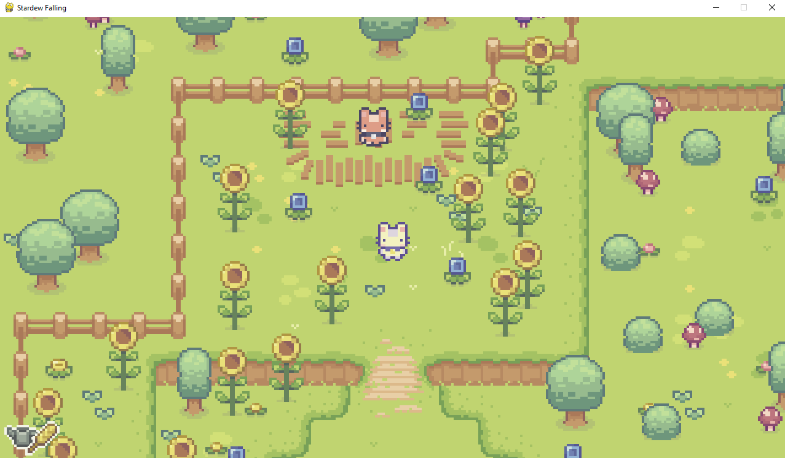

# This is a pygame repository
I am following a tutorial to learn the basics of pygame again.

# Activating VENV
.\venv\Scripts\activate

# Controls
q to switch tools
w to use tool

Currently at 2:42 of [this tutorial](https://www.youtube.com/watch?v=T4IX36sP_0c)

